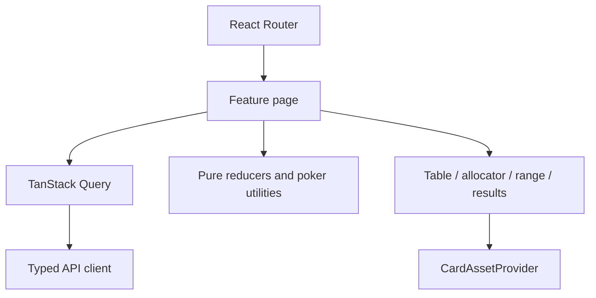

# Poker Daily Trainer frontend

This is the public browser repository. It may contain React/Vite UI code and
the public contracts package, but never GTO frequencies, reached ranges,
solver inputs, database credentials, raw archives, or admin operations.

## Local checks

```bash
pnpm install
pnpm typecheck
pnpm lint
pnpm assets:check
pnpm test
pnpm test:e2e
pnpm build
```

The Playwright config runs each journey in desktop Chromium and a Chromium
mobile viewport. Install the browser once with `pnpm exec playwright install
chromium`; the mobile project intentionally does not require WebKit so a clean
checkout is not dependent on an uninstalled optional browser binary.

The Vite/React shell is implemented. Run locally with
`corepack pnpm dev` and open `http://127.0.0.1:4173`.

Routes are `/`, `/daily`, `/challenge/:spotId`, `/results/:attemptId`,
`/archive`, `/archive/:date`, `/stats`, `/account`, and the loopback-only
`/admin`. A challenge explains preflop context, replays to the decision,
creates an attempt, then navigates to an ownership-checked refreshable result.
Controls come only from API legal actions; allocations are integer basis
points and the featured combo is always included.

The challenge has one unified `Action history` timeline. Known preflop actions
are shown first as static context; replay-controlled public history follows in
the same list. Its `n/m replayed` counter counts only those replay events, and
future event details remain `Locked until replay` until the user plays or
skips the history. The same control row provides play/pause, next action,
replay, skip, and sound. This keeps the story complete without duplicating a
separate “How we got here” and replay panel.

Playback is reducer-driven and persists per-spot state in browser storage so a
refresh does not unexpectedly restart a hand. Pause/resume, replay, skip, and
muted-by-default sound controls are keyboard accessible. Turning sound on from
the control unlocks short generated Web Audio cues for replayed events; if the
browser blocks audio, the hand still works normally. CSS honors
`prefers-reduced-motion`. Storage is optional and failures are ignored safely.

## Static container

The integration Compose file builds this directory into an Nginx image that:

- serves the Vite production build and public card assets;
- returns `200` from `/health/live`;
- proxies same-origin `/api/*` requests to the private `api` service;
- contains no solver artifacts or private solution data.

From `webapp/`:

```bash
docker compose up -d --build frontend
curl http://127.0.0.1:4173/health/live
curl http://127.0.0.1:4173/api/health/live
```

The host binding is loopback-only during development. A public deployment
must point the browser at an authenticated HTTPS API; keeping backend source
private does not make a browser `localhost` endpoint reachable by users.

## Frontend architecture

`src/api/client.ts` is the only server communication module. Feature pages use
TanStack Query; poker calculations live in `src/domain`; table, allocator,
range-modal, and result components are presentational. Vitest covers reducers,
blockers, allocation boundaries, and dynamic action counts. Playwright uses
deterministic intercepted v3 fixtures and avoids arbitrary sleeps.



## Contracts boundary

The source consumes the reviewed `@poker-trainer/contracts@0.3.0` tarball from
`vendor/`, so this repository and Docker build do not depend on a sibling
checkout. npm publication remains approval-gated. After explicit release
approval, replace the tarball spec with exact registry version `0.3.0`,
regenerate this repository's lockfile, and rebuild. Never publish from Docker
or CI automatically.
The browser receives only public challenge/action schemas; solution
percentages are withheld until the private backend accepts a submission.

The `/admin` page is a local operator view. It reads the loopback-only queue,
Pacific publication calendar, coverage warning, and guarded job controls; it
does not contain solver output or answer data in the frontend bundle. In the
Compose development stack, Nginx adds a private marker for admin proxy
requests only when the browser reached Nginx through `localhost`, `127.0.0.1`,
or `::1`, and the API accepts that marker only under the explicit
non-production `ADMIN_TRUSTED_PROXY` setting. A public hostname, including a
Cloudflare Tunnel hostname, does not receive the marker. Keep both
`ADMIN_ENABLED` and `ADMIN_TRUSTED_PROXY` false when this container is
internet-reachable; production retains strict loopback enforcement.

## Visual assets and public-repository boundary

The target trainer uses the user's poker-table artwork and the public-domain /
CC0 [OpenDecks playing-card deck](https://github.com/AustinGabriel/OpenDecks-Public-Domain-and-CC0-Playing-Cards).
The normalized 52 card faces and two backs are committed in `public/cards/`, so
a clean public checkout can build and run without a private asset-injection
step.

The source repository provides PNG and SVG assets and explicitly permits use,
modification, commercial distribution, and redistribution under CC0. We use
the PNG faces and normalize their descriptive filenames (for example,
`ace of hearts.png`) to the app's stable `Ah.png` convention. The complete
license text is preserved beside the images.

Do not put temporary signed download URLs in source, Dockerfiles, CI variables,
or logs. The frontend uses stable URLs such as `/cards/Ah.png`; because the
images are CC0, they may be committed, included in the static Docker image,
and served by GitHub/Vercel/Netlify-style builds. Do not reference a developer's
`Downloads` directory at runtime.

### Swappable asset provider

UI code does not construct card filenames itself. It consumes the
`CardAssetProvider` interface exported by
[`src/assets/card-assets.ts`](src/assets/card-assets.ts). The current
`OpenDecksCardAssetProvider` maps the normalized paths, and `cardAssets` is the
injected application default. To change artwork later, add another provider
that implements the same interface and change the provider binding; the table,
history playback, and challenge components remain unchanged.

### Asset credits

Playing-card artwork used by the production application:

- [OpenDecks Public Domain / CC0 Playing Cards](https://github.com/AustinGabriel/OpenDecks-Public-Domain-and-CC0-Playing-Cards)
- [Creative Commons CC0](https://creativecommons.org/publicdomain/zero/1.0/)

The exact license text is preserved at
[`public/cards/LICENSE-OPENDECKS.txt`](public/cards/LICENSE-OPENDECKS.txt). The
frontend implementation and asset mapping are specified in
[frontend-structure.md](frontend-structure.md).
