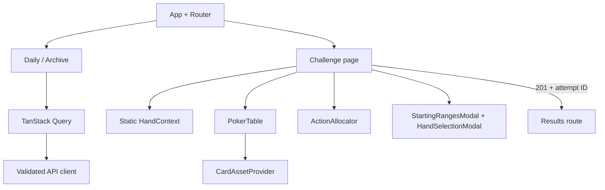
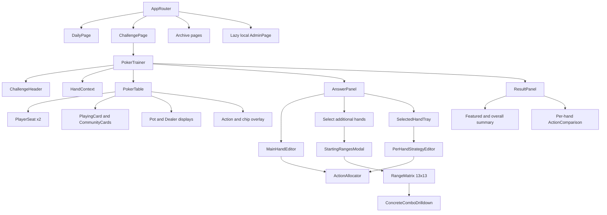
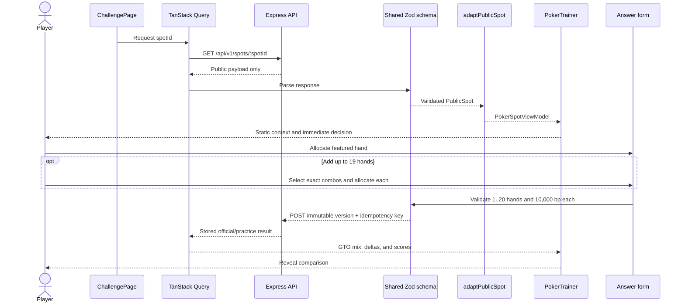
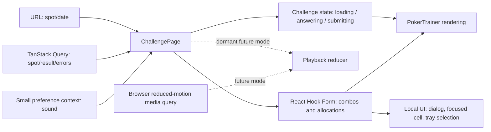

# Poker Daily Trainer: Frontend Architecture

## Implemented v3 trainer

The current source implements the public v3 `DailyGame → Spot → Attempt →
Attempt Result` boundary. `main.tsx` is the single composition root
for the router and TanStack Query;
`src/api/client.ts` validates every response with shared Zod schemas;
`features/` contains daily, challenge, results, archive, stats, account, and
local-admin pages; `components/` contains the preflop story, table, dynamic
legal-action allocator, modal range matrix, settings, and result comparison.
`src/domain/allocations.ts`, `range.ts`, and
`playback.ts` are pure, deterministic utilities covered by Vitest.



Concrete range-cell and exact-suit drill-down, refreshable results, calendar archive, and real
official-attempt statistics are implemented. The
Playwright suite runs the same deterministic journeys at desktop and a mobile
viewport using Chromium mobile emulation, so a clean checkout only needs the
documented Chromium browser install. A separately provisioned WebKit job may
be added for browser-engine coverage without changing product assertions. The
remaining deployment-level work is provider authentication UI and connecting
the local admin calendar mutations to a separately protected operator
deployment.

## Purpose and boundaries

This document defines the target Vite + React + TypeScript client for the
daily poker trainer. The frontend is a reusable visualization and interaction
layer for normalized poker spots; it is not a real-time poker client. It
renders the complete static hand context, presents the decision, collects strategy percentages,
and renders the server's post-submission comparison.

The frontend does not parse TexasSolver output, choose solver nodes, calculate
authoritative scores, infer legal actions from display text, or receive private
solutions before a submission succeeds. See
[../../overall-structure.md](../../overall-structure.md) for dependency order,
[../backend/backend-structure.md](../backend/backend-structure.md) for API
behavior, and [../../storage-and-retrieval.md](../../storage-and-retrieval.md)
for the public/private storage boundary.

The central reusable boundary is conceptually:

```tsx
<PokerTrainer spot={validatedPublicSpot} />
```

`PokerTrainer` must behave identically whether the validated spot came from
today's API, the archive, a static fixture, a replay, or a future custom
practice route.

## Product and visual principles

- Make the poker table the visual center, not one card in a generic dashboard.
- Use restrained typography, spacing, shadows, borders, and color. Avoid
  glassmorphism, excessive gradients, neon, decorative icons, and nested
  rounded containers.
- Keep hero visually anchored at the bottom and opponent at the top. Public
  spot data changes the IP/OOP, poker-position, dealer, and actor labels.
- Generate every decision control from the API's ordered `legalActions`.
- Give every challenge one required main concrete hand and an optional route
  to select up to nineteen more exact concrete hands.
- Keep the persistent textual hand history readable even when animations are
  skipped, disabled, or complete.
- Represent answers as integer basis points. Each submitted hand contains all
  legal action IDs exactly once and totals exactly `10_000`.
- Never place GTO frequencies, private reached ranges, or answer-bearing test
  fixtures in the public bundle.
- Prefer straightforward React, one-way data flow, strong types, and small
  domain utilities over a global state library or speculative abstractions.

## Planned libraries

| Need | Choice | Responsibility |
| --- | --- | --- |
| Build/runtime | Vite + React + TypeScript | SPA build and typed components |
| Routing | React Router | Daily, challenge, archive, and local-admin routes |
| Server state | TanStack Query | Validated reads, caching, retries, mutations, and invalidation |
| Forms | React Hook Form | Per-combo allocators and exact-total validation |
| Contracts | Shared Zod schemas | Runtime validation at the browser boundary |
| Styling | Tailwind CSS plus CSS custom properties | Tokens, responsive layout, and state variants |
| Animation | CSS transforms/transitions/keyframes | Card dealing and lightweight action transitions |
| Unit/components | Vitest + React Testing Library | Domain logic and accessible interactions |
| End to end | Playwright | Complete daily, challenge, range, retry, and archive flows |

Do not add Redux, Zustand, or Framer Motion in version 1. React reducers own
the two state machines, TanStack Query owns remote data, and React Hook Form
owns editable allocations. Revisit a library only after measured complexity
shows a concrete need.

## Routes

| Route | Purpose | Important behavior |
| --- | --- | --- |
| `/` | Landing | Concise product introduction and “Play today” action |
| `/daily` | Today's ordered spots | Preserve API `slotOrder` and display fallback status |
| `/challenge/:spotId` | Trainer | Show static context, edit featured/extras, and create an attempt |
| `/results/:attemptId` | Refreshable result | Ownership-checked GTO comparison, range drill-down, retry, and next spot |
| `/archive` | Archive index | Date-range calendar with availability/completion/score |
| `/archive/:date` | One publication date | Preserve actual Pacific date and ordered spots |
| `/stats` | Current principal stats | Streaks, official performance, minimum-three-sample breakdowns, and history |
| `/account` | Identity status | Explain guest/account separation without claiming guest migration |
| `/admin` | Local control plane | Lazy-loaded and rendered only after localhost access succeeds |

Unknown routes render a useful not-found page. A fallback daily response stays
on `/daily`, displays its real publication date, and never masquerades as a
new completion for today.

## Challenge state model

```text
loading
→ answering
→ submitting
→ navigate to /results/:attemptId
→ optional practice retry from the result resource
```

| State | Responsibility and exits |
| --- | --- |
| `loading` | Fetch and validate; continue to introduction or an explicit error state |
| `answering` | The decision table and answer editor are available immediately; static context is shown above them |
| `submitting` | Freeze the submitted snapshot while the mutation is in flight |
| result route | Fetch the ownership-checked attempt resource and render comparisons |
| practice retry | Return to the challenge while the official result remains immutable |

The server is authoritative for official/practice status. The frontend must
not predict that a submission will be official.

### Static challenge context

`HandContext` is the single story surface on a challenge. It builds a compact,
responsive context strip from the API response. The action sequence is rendered
as a readable arrow-separated line; street/board, pot, effective stack, and the
current decision are distinct labeled fields rather than a dense paragraph or
duplicated metadata row. It never hardcodes positions, scenario names, or bet
sizes. The presentation layer
(`formatHand`, `formatPosition`, `formatLegalActionLabel`, `storyLine`,
`decisionLabel`, and `turnLabel`) translates wire notation into phrases such as
`Flop · Your Decision`, `Opponent (BTN) opens to 2.5 bb. You call from BB.`,
`You · BB · OOP`, and `Opponent · BTN · IP`. `resolveSpotPlayers()` is the one
presentation source for hero/opponent role, actual poker position, IP/OOP lane,
dealer ownership, and postflop order. It derives the dealer from `BTN`, never
from hero identity or visual seat order. Structured preflop actions supply the
actual position when a legacy presentation object contains only generic
`IP`/`OOP` labels. The same resolver is used by the hand context, table, range
headings, saved-hand list, and result summaries.

The table always renders `spot.decision`, and the answer editor is enabled as
soon as the spot is loaded. Playback is intentionally absent from the active
route: the old `playback.ts` reducer and `poker-sound.ts` service remain small,
tested dormant infrastructure for a future opt-in animation mode. There is no
replay counter, locked history, or sound control in the current challenge UI.

Starting ranges are secondary. `StartingRangesModal` opens a full-screen,
accessible dialog with role-specific headings, independent horizontal matrix
scroll containers, a legend, Escape/backdrop close, focus trapping/restoration,
and body-scroll locking. The modal uses only `preflop.rangeAssumptions` from the
validated API response. Every action allocator renders the API's ordered legal
actions; absolute numeric amounts are formatted with the configured `bb` or
`chips` unit, while user percentages remain a separate input.

## Public contract and frontend models

### Shared transport types

The shared public package owns card/combo validation, table state, history,
legal actions, spot responses, attempt requests, and attempt results. API card
codes remain compact strings such as `Ah`; frontend adapters may parse them
into presentation objects without changing the wire representation.

The implemented v3 contract uses this shape:

```ts
type PublicSpot = {
  schemaVersion: 3;
  spotId: string;
  spotVersionId: string;
  publicationDate: string;
  slotOrder: number;
  preflop: KnownPreflopContext | UnknownPreflopContext;
  initialState: TableState;
  history: PublicHistoryEvent[];
  decision: TableState;
  legalActions: LegalAction[];
  featuredCombo: Combo;
  selectableCombos: SelectableCombo[];
  presentation: SpotPresentation;
};

type SpotPresentation = {
  heroActor: "ip" | "oop";
  dealerActor: "ip" | "oop";
  positions: { ip: string; oop: string };
  holdingVisibility: "featured_hero";
  chipUnit: "currency" | "bb";
};
```

Known preflop context contains semantic action chips plus sparse IP/OOP
hand-class inclusion assumptions in basis points. These are solver input
assumptions, not postflop reached ranges. Unknown legacy context is labeled
honestly. Neither variant contains GTO frequencies, reach weights, EVs, or
enough data to reconstruct the answer. The featured combo is always included
in `selectableCombos`.

### Frontend-only models

Keep these out of the public contracts package:

- `CardView`: parsed rank, suit, accessible name, color, and asset URL.
- `PokerSpotViewModel`: validated spot plus hero-bottom seat mapping and
  formatted chip/position labels.
- `VisibleTableState`: a future animation-mode snapshot; the active challenge
  renders the server-provided decision directly.
- `ChallengePhase`: route-local state-machine phase.
- `PlaybackState`: dormant future-mode event index, speed, paused/skipped state,
  and visible table.
- `AnswerDraft`: featured combo plus optional concrete combos and allocations.
- `RangeCellView`: one 13x13 class with available, blocked, and selected exact
  combinations.
- `SoundPreference`: enabled/muted state only; audio instances remain in a
  service, not serializable React state.

`adaptPublicSpot` is the only place that converts a validated transport spot
into a table-oriented view model. CSS components do not parse cards, compute
pot changes, or infer poker semantics from labels.

## Component architecture



### Responsibilities

- `ChallengePage` owns fetching, schema failure, route identity, and the
  challenge controller. It does not render poker details itself.
- `PokerTrainer` composes one validated/adapted spot and exposes callbacks for
  submission and practice retry.
- `PokerTable` renders normalized props only. It knows seat coordinates but
  not solver-tree structure. Seats show `You`/`Opponent` first and one compact
  `BB · OOP`/`BTN · IP` line beneath it. The dealer badge is rendered only when
  the shared player resolver reports a `BTN` position; verbose duplicate
  `In position`/`Out of position` copy is forbidden.
- `PlayingCard` accepts known card, face-down state, size, animation state,
  disabled/ghost state, and accessible label.
- `HandContext` is the single static story surface for the active challenge. It
  formats preflop actions, public history, board, pot, effective stack, and
  current actor into one compact sentence. It uses the shared actor formatter
  so `You`/`Opponent`, position, and IP/OOP never drift between the story,
  table, range modal, and result summary.
- `StartingRangesModal` is the secondary range surface. It owns the full-screen
  dialog behavior, focus trap/restoration, body-scroll lock, role-specific
  headings, legend, and independently scrollable matrices.
- Playback controls and the historical `ActionHistory` component are not part
  of the current route. The pure playback reducer and sound service remain
  dormant, independently tested infrastructure for a future opt-in mode.
- `ActionAllocator` is the single strategy editor used for the featured hand
  and every optional hand.
- `RangeMatrix` organizes starting-hand classes; `ConcreteComboDrilldown`
  chooses the exact suit combos that are actual submission/scoring units.
- `ResultPanel` aligns server-returned result actions by action ID and never
  recomputes the authoritative score.

Avoid components that only rename a `<div>`. Create a component when it owns a
domain responsibility, accessibility behavior, reusable visual behavior, or
meaningful test boundary.

## Data flow



Every successful response is parsed before use. Failed parsing produces an
explicit incompatible-data state with a request ID, not a best-effort render.

## State ownership



- TanStack Query owns server data, cache status, request errors, and mutations.
- Challenge-local state owns loading, answering, submitting, modal, and
  allocation transitions. A separate pure reducer owns deterministic event
  playback only for a future opt-in mode; it is not mounted by the current
  challenge route.
- React Hook Form owns allocation maps and selected exact combos.
- Dialog visibility, focused range cell, and result expansion remain local UI
  state.
- One small preference context may expose sound enabled/muted across the
  trainer. Persist the preference in local storage, defaulting to muted.
- The URL owns only spot/date identity. Never put answers, guest identity, or
  solution data in a URL.

An optional local draft may be keyed by immutable `spotVersionId`. Restore it
only after revalidating version, legal action IDs, featured combo, selectable
combos, and schema version. Clear incompatible drafts and successful official
drafts.

## Poker table layout

Use normal document layout around a coordinate-based table interior:

```text
large desktop
┌─────────────────────────────────────┐
│ navigation / static hand context    │
├────────────────────────┬────────────└
│                        │ answer /   │
│ dominant poker table   │ results    │
│                        │ panel      │
├──────────────────────┴────────────┤
│ extra hands / submit                │
└─────────────────────────────────────┘
```

- Use CSS Grid for the page and an `aspect-ratio` container for the table.
- Render the prepared table artwork with `object-fit: contain` as a background
  layer. The supplied 1536x1024 RGB file has a baked checkerboard outside the
  table, so asset preparation must create a clean transparent derivative.
- Use normalized absolute anchors only inside the table for seats, board, pot,
  dealer, action labels, and optional chip visuals.
- Place hero bottom-center and opponent top-center. Display combined labels
  such as “You · BB · OOP” and “Opponent · BTN · IP” from spot data. Visual
  placement does not determine dealer ownership or action order.
- Keep DOM/source order logical: opponent, board/pot, hero, history, decision.
  Visual coordinate positioning must not scramble screen-reader reading order.

## Playing-card architecture

`PlayingCard` does not have 52 component variants. A tested mapper converts a
validated card code into one asset filename and accessible name:

```text
Ah -> Ah.png
Tc -> Tc.png
2s -> 2s.png
```

The OpenDecks source repository contains descriptive filenames and both PNG
and SVG versions. Version 1 needs only the 52 PNG faces and its blue/red backs,
normalized to stable names such as `Ah.png`, `back-blue.png`, and
`back-red.png`. Keep this mapping independent of the physical URL root so tests
can use placeholders while production serves the committed public files.

The mapping lives behind a `CardAssetProvider` interface in
`src/assets/card-assets.ts`. `OpenDecksCardAssetProvider` is the current
implementation and `cardAssets` is the application-level dependency. A future
deck changes only the provider implementation/assets (or injects another
provider into `PlayingCard`); table, playback, and challenge code must never
construct provider-specific filenames directly:

```ts
interface CardAssetProvider {
  face(card: CardCode): string;
  back(variant?: "blue" | "red"): string;
  accessibleName(card: CardCode): string;
}

const imageUrl = cardAssets.face(asCardCode("Ah"));
```

Holding behavior:

- `known`: render the exact cards face up.
- `hidden`: render the requested count using the configured back.
- `range`: render hidden cards plus a non-answer-bearing public range label.
- During optional range editing, the hero cards change to the currently edited
  exact combo; returning to the main editor restores the featured combo.

Every card exposes text such as “ace of hearts.” Suit color is supplemental,
not the only identifier.

## Dormant animation architecture

The active challenge does not require or display replay. If an optional future
animation mode is enabled, use CSS transforms, opacity, and keyframes driven by
the tested playback reducer:

1. The reducer advances to an event.
2. The event derives a stable animation key and destination.
3. The card/action component receives start offset, stagger delay, and phase.
4. CSS performs small translation, scale, opacity, and easing.
5. Completion advances the reducer; it does not mutate poker state in the
   animation component.

Hero cards, opponent backs, flop cards, turn, and river share the same
animation primitive with different destination variables. Stagger card deals.
Skipping folds every remaining event through the same pure reducer and cancels
pending timers. With `prefers-reduced-motion`, apply the final state
immediately or use a minimal fade. Playback and skip must produce byte-for-byte
equivalent final domain state.

## Dormant sound architecture

Use the small `PokerSoundService` in `src/services/poker-sound.ts`, not audio
calls scattered through table components. It is not mounted by the current
challenge route. A future animation route may enable it from a user click
(required by browser autoplay policies) and send newly revealed events to it.

- Default to muted and persist only the preference.
- Initialize/unlock audio after a deliberate user gesture.
- Current cues are short generated Web Audio tones: card deals use a light
  ascending profile, actions a lower cue, and the decision a higher cue.
- Trigger cues from controller transitions, never from arbitrary rerenders.
- Treat audio as optional decoration. Missing or blocked audio cannot interrupt
  answering, submission, or accessibility announcements.
- If recorded card sounds are preferred later, use a provider behind this
  boundary. Kenney's UI Audio pack is CC0, and Breviceps' “Shuffle cards” is
  also CC0; neither is required by the current generated implementation.

## Strategy editor

`ActionAllocator` accepts ordered `legalActions`, one allocation map, and an
`onChange` callback. It creates one row per API action in API order.

```ts
{
  a0: 729,
  a1: 9271,
  a2: 0
}
```

Use a visible segmented summary bar, integer-backed sliders, and direct numeric
percentage inputs. Numeric entry is authoritative for precision; the segment
bar is a summary in V1 rather than a complex drag surface.

Rules:

- Values are integers from `0` to `10_000` and total exactly `10_000`.
- Display at most two decimal places while retaining basis points internally.
- Show remaining/excess percentage continuously.
- Provide pure-action shortcuts, reset, and deterministic equalize.
- Do not silently rebalance other actions when one value changes. If offering
  “take remainder from action,” name the affected action and show the result.
- Use `displayLabel` for primary text and structured type/amount fields for
  accessibility context.
- Treat check, bet, call, raise, fold, and all-in through the same path. Bet
  sizes and action counts are runtime data.

## Optional 13x13 range expansion

The matrix uses ranks `A K Q J T 9 8 7 6 5 4 3 2` on both axes:

- diagonal: pairs;
- upper triangle: suited classes;
- lower triangle: offsuit classes.

The 169 cells are discovery/navigation controls, not submitted hands. Opening
a cell shows its exact suit combinations. Only public selectable combos may be
added; board-blocked combos are absent or disabled with a reason.

The selected-hand tray always contains the pinned featured combo. The user can
add zero through nineteen extras for twenty total. Each exact combo has an
independent `ActionAllocator`. Unselected classes and combos do not validate,
submit, or affect scoring.

Design cells to accept optional display metadata later, but do not expose
private reach weights or solver strategy intensity. A future class-frequency
feature can add a separate value layer without changing exact-combo submission
identity.

## Results

- Show the featured-hand result first.
- When extras were submitted, show the equal average across all submitted
  concrete hands and each individual hand beneath it.
- Align action rows by action ID and show submitted percentage, GTO percentage,
  signed delta, absolute delta, and GTO-majority action.
- Signed delta is `submitted - GTO`; `+12%` means the player used that action
  twelve percentage points too often.
- Show official/practice status exactly as returned.
- A practice retry creates a new editable draft while retaining the prior
  official result for reference.

The server-returned score is authoritative. Tests may recompute the documented
L1 formula to detect contract drift, but production UI does not rescore:

```text
similarity = 100 * (1 - 0.5 * sum(abs(predicted_i - gto_i)))
overall = sum(submitted hand similarities) / submitted hand count
```

## API interaction and failures

- Send same-origin credentials; JavaScript never reads the opaque guest cookie.
- Retry idempotent reads with bounded delay. Never blindly retry an attempt
  after an ambiguous failure; preserve its idempotency key and recover the
  stored result first.
- Treat `404` as unavailable/unpublished, `409` as stale version/state,
  `422` as invalid answer, and `429` as rate limited.
- Respect ETags for immutable public spot reads.
- Preserve the user's answer after transport failure.
- On version conflict, fetch the current version and require review; never map
  old allocations onto new action IDs silently.
- Missing visual/audio assets use an accessible fallback and report a bounded
  diagnostic without blocking play.
- A challenge with no legal actions, duplicate/blocking cards, missing featured
  combo, or featured combo outside the selectable catalog fails schema/domain
  validation and is not rendered as answerable.

## Responsive behavior

- **Large desktop:** table takes roughly two-thirds of the primary row; answer
  panel takes one-third; the static hand-context strip sits above both.
- **Laptop:** retain table dominance but allow the answer panel to move below
  when its minimum usable width would be violated.
- **Tablet:** use a vertical table followed by the answer editor, with the
  context strip remaining above both.
- **Mobile:** use a compact poker-stage presentation rather than squeezing the
  desktop table. Keep context, opponent, board/pot, hero, and actions in clear
  order.
- The 13x13 grid may scroll horizontally, but keep rank labels visible and
  provide a searchable/list alternative for keyboard and small-screen users.
- Never hide the required total, submit status, or selected-hand count behind
  hover behavior.

## Accessibility

- Target WCAG 2.2 AA for public flows.
- Use landmarks, a skip link, semantic headings, ordered history, buttons,
  dialogs, labels, and form error associations.
- Support keyboard-only allocation and range selection with visible focus.
- Dialogs trap focus, close predictably, and restore focus to their trigger.
- The active challenge announces static context and current actor clearly;
  dormant playback infrastructure must announce one event at a time if it is
  enabled in a future route.
- Respect reduced motion and never require audio.
- Use text and symbols in addition to red/green for suits, errors, and deltas.
- Expose each range cell's class, availability, selected concrete count, and
  drill-down action to assistive technology.

## Project organization

Keep feature ownership clear without deep enterprise nesting:

```text
src/
  app/
    router.tsx
    providers.tsx
    styles.css
  routes/
    daily/
    challenge/
    archive/
    admin/
  features/trainer/
    PokerTrainer.tsx
    table/
    playback/
    answer/
    range/
    results/
    model/
  shared/
    components/
    hooks/
    lib/
  assets/
    table/
    manifest/
public/
  cards/                 # committed CC0 faces, back, and license notice
  sounds/                # optional separately licensed files
```

Shared transport types come from `@poker-trainer/contracts`; do not duplicate
them under `src/types`. Poker-domain view models and reducers live with the
trainer feature. Promote a utility to `shared` only after a second real
consumer exists.

## Licensed asset organization and attribution

The production application uses the OpenDecks public-domain / CC0 deck.
Therefore:

```text
public Git repository
✅ React/TypeScript components
✅ CSS and card-code filename mapping
✅ 52 normalized card faces and blue/red backs
✅ CC0 license notice and provenance
✅ compiled application serving the images needed by the browser
```

React references the committed files through stable URLs such as
`/cards/Ah.png`; no asset API or private build injection is required. Do not
store temporary download URLs in source, Docker layers, CI configuration, or
logs. Keep the source checkout outside the repository and commit only the
normalized files needed by the app plus the license notice.

Do not reference a developer's `/Users/.../Downloads` directory at runtime.
Preserve the [OpenDecks license](https://github.com/AustinGabriel/OpenDecks-Public-Domain-and-CC0-Playing-Cards/blob/main/LICENSE)
beside the images. Attribution is not required by CC0, but the source and its
underlying public-domain/CC0 contributors are recorded in
[`ASSET_CREDITS.md`](./ASSET_CREDITS.md). Do not use “OpenDecks” as the brand
name of a redistributed modified deck because the source README identifies it
as a trademark.

The supplied poker-table image is copied into the frontend's table assets only
during the later asset implementation step, after creating a clean transparent
web derivative. Record its provenance separately from the OpenDecks artwork.

## Testing strategy

### Unit and property tests

- All 52 card-code-to-file mappings, accessible card names, and face-down state.
- Public-spot adaptation, fixed hero seat, dynamic IP/OOP/position/dealer labels,
  and known/hidden/range holdings.
- Dormant playback reducer equivalence for play, pause, replay, skip, and
  reduced motion; the active challenge does not mount it.
- Basis-point formatting, parsing, exact totals, pure-action shortcuts, and
  deterministic equalization for arbitrary legal-action counts.
- All 169 matrix cells, all 1,326 concrete Hold'em combos, category mapping,
  board blockers, featured pinning, duplicates, and 1/20/21 boundaries.
- Challenge phase transitions and signed result deltas.

### Component tests

- Table rendering from multiple fixtures without hand-specific branches,
  including consistent `You`/`Opponent` role labels.
- Static hand-context story generation with dynamic amounts, streets, board,
  pot, effective stack, and unknown-preflop handling.
- Immediate strategy availability, numeric input, reset, equalize, error, and
  focus behavior.
- Starting-range full-screen dialog, independent matrix scrolling, Escape and
  backdrop close, focus restoration, and range-dialog/drill-down behavior.
- Pinned main hand, optional extras, removal, and independent per-hand
  allocations.
- Loading, empty, fallback, malformed response, stale version, rate limit,
  missing asset, failed submission, and expired-session behavior.
- Sound default/muting, user-gesture activation, no duplicate transition sound,
  and graceful audio failure.
- Automated accessibility checks plus deliberate focus/live-region assertions.

### Playwright journeys

1. Open today, read the static context, submit only the featured hand, and
   receive an official result.
2. Add concrete combos from several cells, reach twenty total, answer each,
   submit, and verify equal-average output.
3. Attempt a twenty-first hand and invalid totals and receive focused errors.
4. Retry the official attempt and receive a practice result without losing the
   official comparison.
5. Recover an ambiguous submission with the same idempotency key.
6. Browse archive/fallback spots while preserving actual Pacific dates.
7. Exercise reduced-motion, keyboard-only, mobile, and missing-asset paths.
8. Open the loopback admin dashboard, observe the below-three warning, and
   exercise a guarded queue action through the local proxy.

## Ordered implementation sequence

1. Keep the v3 contract, preflop context, daily-game resources, and fixtures synchronized.
2. Build route/providers, design tokens, error states, and spot adapter.
3. Import the normalized OpenDecks cards, wire `CardAssetProvider`, and implement/test `PlayingCard` and the table.
4. Keep the pure playback reducer, controls, animation, and sound tested as
   dormant future infrastructure; do not mount it in the active challenge.
5. Implement the featured-hand allocator and typed submission snapshot.
6. Add the 13x13 navigator, exact-combo drill-down, tray, and extra allocators.
7. Navigate from `201 Created` to the refreshable result route; integrate official/practice retry, archive, statistics, and fallback UX.
8. Keep the localhost admin interface behind the guarded proxy and complete
   accessibility, responsive, component, and Playwright gates before any
   separately protected operator deployment.

## Frontend completion checklist

- [x] The shared contract implements v3 preflop context, typed replay events, and the featured-hand-plus-extras model.
- [x] The route shell renders v3 public fixtures without hardcoded legal actions.
- [x] The table is visually dominant, hero stays at the bottom, and labels come from data.
- [x] Public Git contains only the normalized OpenDecks CC0 card assets, license notice, and provider mapping; no temporary download URL or Downloads path is used at runtime.
- [x] The active challenge renders the decision immediately; dormant playback
  and reduced-motion infrastructure remains independently tested.
- [x] Actions are generated only from API `legalActions` and every hand totals `10_000` basis points.
- [x] The featured combo is always included; zero to nineteen optional concrete combos may be added.
- [x] Aggregate cells and unselected combos never affect validation or scoring.
- [x] No solution appears before an accepted stored submission.
- [x] Official/practice status and result math come from the backend response.
- [x] Responsive, accessibility-oriented controls, failure states, unit, component, and Playwright smoke gates pass.
